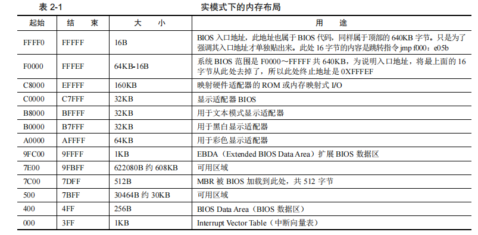
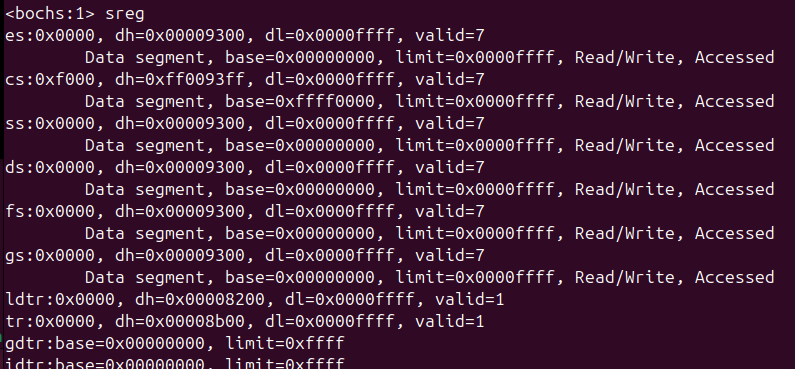
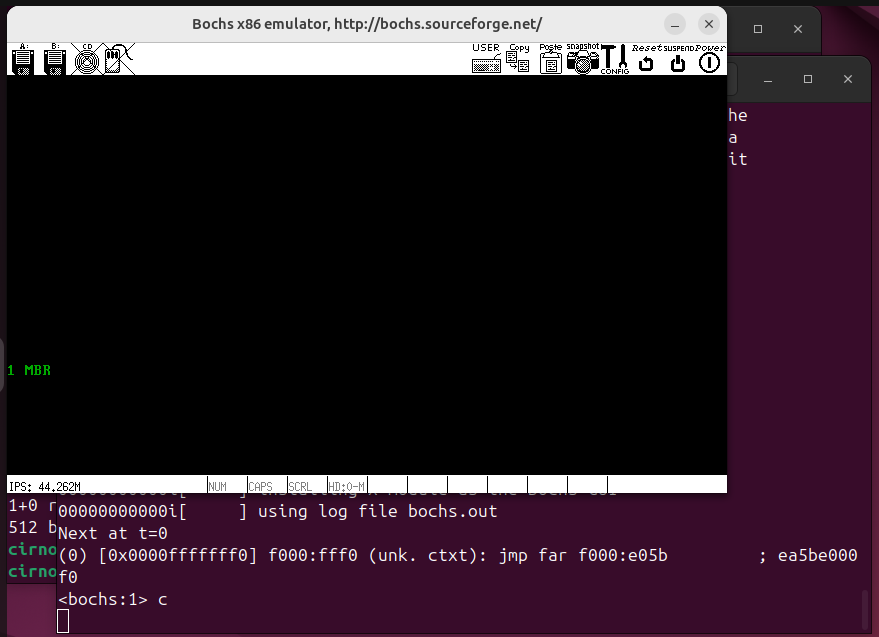

# 编写MBR主引导记录
## 软件接力第一棒，BIOS
### 实模式下的1MB内存布局


从低地址看，地址 0～0x9FFFF 处是 DRAM（Dynamic Random Access Memory），即动态随机访问内存，我们所装的物理内存就是 DRAM，如 DDR、DDR2 等。
动态指此种存储介质由于本身电气元件的性质，需要定期地刷新。

顶部的 0xF0000～0xFFFFF，这 64KB 的内存是 ROM。这里面存的就是 BIOS 的代码。BIOS 的主要工作是检测、初始化硬件，硬件自己提供了一些初始化的功能用，BIOS 直接调用就好了。BIOS 还做了一件伟大的事情，建立了中断向量表，这样就可以通过“int 中断号”来实现相关的硬件调用，当然 BIOS 建立的这些功能就是对硬件的 IO 操作，也就是输入输出，但由于就 64KB 大小的空间，不可能把所有硬件的 IO 操作实现得面面俱到，而且也没必要实现那么多，毕竟是在实模式之下，对硬件支持得再丰富也白搭，精彩的世界是在进入保护模式以后才开始，所以挑一些重要
的、保证计算机能运行的那些硬件的基本 IO 操作，就行了。这就是 BIOS 称为基本输入输出系统的原因。插在主板上的物理内存不是CPU眼里“全部的内存”的原因：

在计算机中，并不是只有咱们插在主板上的内存条需要通过地址总线访问，还有一些外设同样是需要通过地址总线来访问的，这类设备还很多呢。若把全部的地址总线都指向物理内存，那其他设备该如何访问呢？由于这个原因，只好在地址总线上提前预留出来一些地址空间给这些外设用，这片连续的地址给显存，这片连续的地址给硬盘控制器等。留够以后，地址总线上其余的可用地址再指向 DRAM，也就是指插在主板上的内存条、我们眼中的物理内存。

### bios是如何苏醒的
bios是由硬件加载的，这个硬件相当于是ROM。

BIOS 代码所做的工作也是一成不变的，而且在正常情况下，其本身是不需要修改的，平时听说的那些主板坏了要刷 BIOS 的情况属于例外。于是 BIOS 顺理成章地便被写进此 ROM。ROM 也是块内存，内存就需要被访问。此 ROM 被映射在低端 1MB 内存的顶部，即地址 0xF0000～0xFFFFF 处，只要访问此处的地址便是访问BIOS，这个映射是由硬件完成的。

BIOS 本身是个程序，程序要执行，就要有个入口地址才行，此入口地址便是 0xFFFF0

在开机的一瞬间，也就是接电的一瞬间，CPU 的 cs：ip 寄存器被强制初始化为 0xF000：0xFFF0。由于开机的时候处于实模式，再重复一遍加深印象，在实模式下的段基址要乘以16，也就是左移4位，于是0xF000：0xFFF0 的等效地址将是0xFFFF0。上面说过了，此地址便是 BIOS 的入口地址。

bochs仿真机开机启动时，各个寄存器指向的地址，可以看出来cs寄存器是指向0xF000的。


### 为什么是0x7c00
MBR 所在的位置是磁盘上最开始的那个扇区。
如果此扇区末尾的两个字节分别是魔数 0x55 和 0xaa，BIOS 便认为此扇区中确实存在可执行的程序，便加载到物理地址 0x7c00，随后跳转到此地址，继续执行。
BIOS 跳转到 0x7c00 是用 jmp 0：0x7c00 实现的，这是 jmp 指令的直接绝对远转移
用法，段寄存器 cs 会被替换，这里的段基址是 0，即 cs 由之前的 0xf000 变成了0。

MBR 的大小必须是 512 字节，这是为了保证 0x55 和 0xaa 这两个魔数恰好出现在该扇区的最后两个字节处，即第 510 字节处和第 511 字节处，这是按起始偏移为 0 算起的。
由于我们的 bochs 模拟的是 x86 平台，所以是小端字节序，故其最后两个字节内容是 0xaa55，写到一起后似乎有点不认识了，不要怕，拆开就是 0x55 和 0xaa。

编写mbr程序:
``` x86asm
section MBR vstart=0x7c00
    mov ax,cs
    mov ds,ax
    mov es,ax
    mov ss,ax
    mov fs,ax
    mov sp,0x7c00

; 清屏利用0x06号的功能
; ----------------------------------------
; INT 0x10 功能号0x06 功能描述：上卷窗口
; ----------------------------------------
;输入：
;AH 功能号=0x06
;AL = 上卷的行数
;BH = 上卷的属性
;(CL,CH) = 窗口左上角的(X,Y)的位置
;(DL,DH) = 窗口右下角的(X,Y)的位置
;无返回值
    mov ax,0x600
    mov bx,0x700
    mov cx,0            ;左上角(0,0)
    mov dx,0x184f       ;右下角(80,25)
                        ;VGA文本模式中，一行只能容纳80个字符，共25行
                        ;下标从0开始，所以0x18=24,0x4f=79
    int 0x10        

;;;;;; 获取光标位置
;.get_cursor 获取光标位置，在光标位置处打印字符串
    mov ah,3            ;输入：3号子功能是获取光标的位置，需要存入ah寄存器
    mov bh,0            ;bh寄存器存储的是待获取光标的页号

    int 0x10            ;输出，ch=光标开始行，cl=光标结束行
                        ;dh=光标开始行，dl=光标结束行

;;;;;; 打印字符串
    mov ax,message
    mov bp,ax           ;es:bp为串首地址，es此时和cs一致
                        ;开头已经为sreg初始化

    ; 光标位置要用到dx寄存器中的内容，cx中的光标位置可以忽略
    mov cx,5            ;cs为串长度，不包括结束符0的字符个数
    mov ax,0x1301       ;子功能号13显示字符以及属性，要传入ah寄存器
                        ;al设置写字符方式  ah=01：显示字符，光标跟随移动
    mov bx,0x2          ;bh存储要显示的页号，此处是第0页
                        ;bl中是字符属性，属性为黑底绿字(bl=02h)
    int 0x10

    jmp $

    message db "1 MBR"
    times 510-($-$$) db 0 ;mbr512个字节，这里是为了将前面的字节填满
    db 0x55,0xaa
    
```

将其复制到bochs的启动磁盘的首块后，再启动bochs即可观察到悬浮的1MBR绿色字符，并且陷入阻塞。

